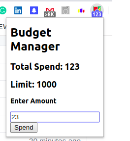
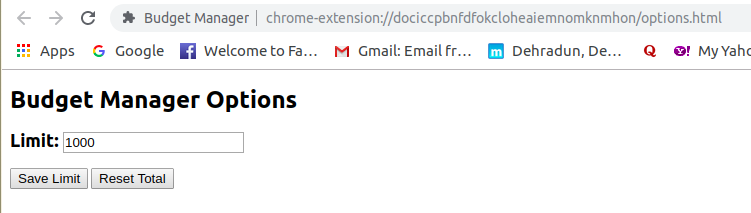
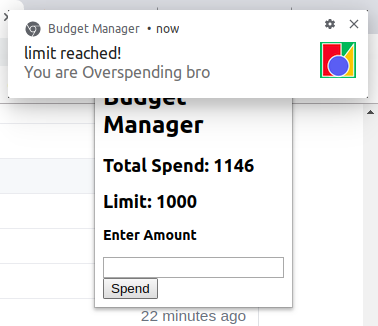
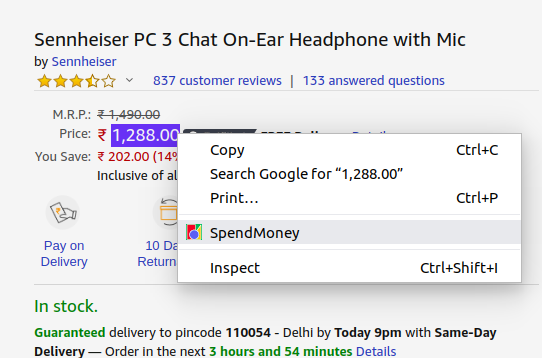

# Budget-Manager-Chrome-Extension
A chrome extension which let us add and keep track of our daily spending and notifies if it goes beyond limit.

# Screenshots

We can enter our spendings and it will get added in the Total Spendings.

 Total Spendings are displayed with the icon of the extension on the toolbar.

  
  
 We can set the spending limit in the options page

 
     
 If the spendings reach above or equal to the limit, we get a notification for overspending.

 
    
 It also consists of the feature of a context menu so that we can add the spendings directly from the webpage by highlighting the amount that we are going to spend.

